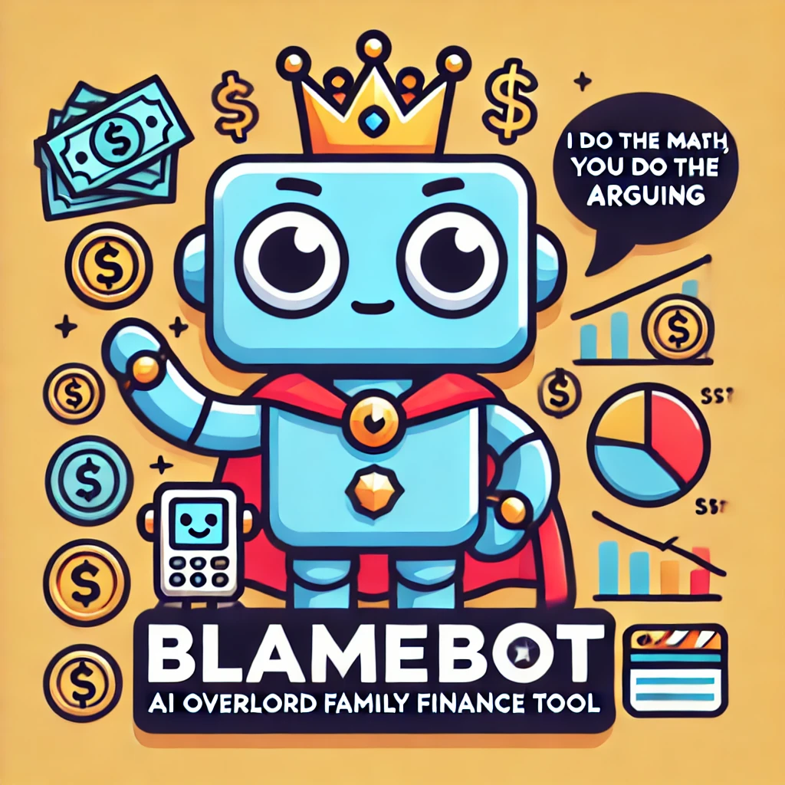
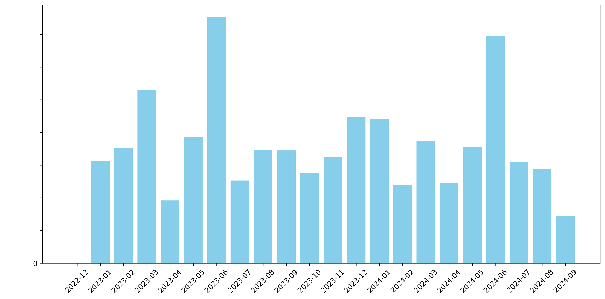
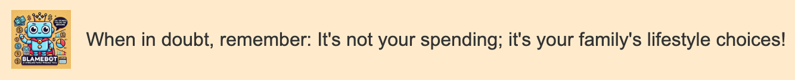
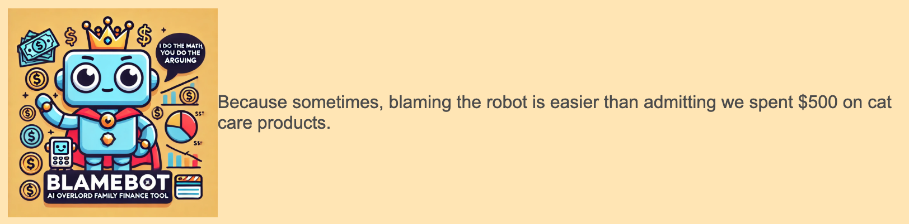
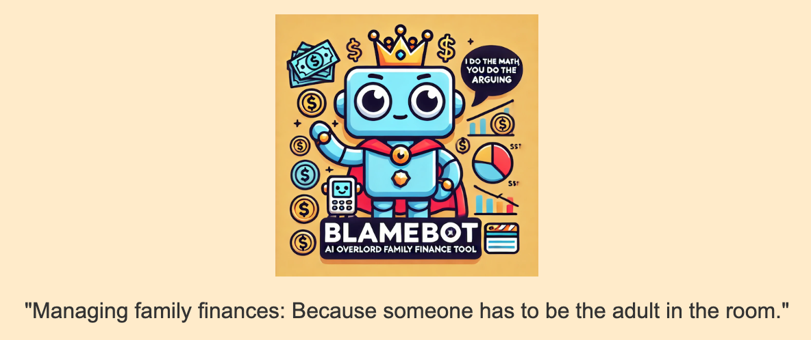

# [BlameBot](https://blamebot.com): AI Overlord Family Finance Tool Because You Can't Math and Need More Reasons to Argue

<div align="center">
  
</div>

BlameBot is a Python-based tool designed to help families analyze their financial data using advanced AI techniques like ChatGPT, Natural Language Processing (NLP), and clustering. It processes financial statements from various sources, unifies the data, and generates insightful reports to better understand spending habits. And yes, it might just give you more reasons to argue.

## Features

- **Multi-Source Data Integration**: Supports processing of financial statements from US credit cards (USD) and UK bank accounts (GBP).
- **Amazon cross referencing**: Refines transaction descriptions by cross referencing Amazon order history.
- **AI-Driven Clustering**: Uses FastText embeddings and clustering algorithms (HDBSCAN, DBSCAN, or KMeans) to categorize transactions.
- **Smart Categorization**: Leverages GPT-4o to refine and clarify cluster names for intuitive spending categories.
- **Visual Insights**: Generates a word cloud and bar chart to visualize spending patterns and monthly expenditures.

## Description of Directories and Files

The project is organized as follows:

```
blamebot/
├── data/
├── images/
├── html/
├── src/
│   ├── __init__.py
│   ├── main.py
│   ├── account_processor.py
│   ├── amazon_processor.py
│   ├── ai_classifier.py
│   ├── currency_converter.py
│   ├── openai_utils.py
│   ├── report_generator.py
│   └── visualization.py
├── requirements.txt
└── README.md
```

   * `data/`
   Contains all input data files, such as bank statements and transaction records. Place your CSV files and any other data the application needs to process in this directory.
   * `images/`
   Stores images generated by the application, such as word clouds and charts used in the reports.
   * `html/`
   Contains the HTML reports generated by the application.
   * `src/`
   The main source code directory containing all modules of the application.
   * `__init__.py`
   An empty file that makes Python treat the directory as a package.
   * `main.py`
   The entry point of the application. It orchestrates the execution by calling functions and classes from other modules.
   * `account_processor.py`
   Contains classes and functions for processing account data from different sources (e.g., UK bank accounts, US credit cards).
   * `amazon_processor.py`
   Handles the processing and cross-referencing of Amazon order data with bank statements.
   * `ai_classifier.py`
   Implements the AI-based classification logic for categorizing transactions using techniques like FastText and clustering algorithms.
   * `currency_converter.py`
   Provides functionality for converting currencies, such as GBP to USD, using exchange rate data.
   * `openai_utils.py`
   Offers utilities for interacting with the OpenAI API, including tracking API usage and costs.
   * `report_generator.py`
   Responsible for generating the financial reports in HTML format.
   * `visualization.py`
   Contains functions for generating visualizations like word clouds and charts.
   * `requirements.txt`
   A list of all Python packages and dependencies required to run the application. 
   * `README.md`
   The main README file providing an overview of the project, setup instructions, usage guidelines, and other relevant information.

## Getting Started

### Prerequisites

To run BlameBot, you will need:

- Python 3.x
- The required Python packages listed in `requirements.txt`
- An OpenAI API key (for GPT-4 based cluster name clarification)

### Installation

Before running the Python code, ensure you have the following dependencies installed.

1. Clone the repository:
   ```bash
   git clone https://github.com/yourusername/BlameBot.git
   ```
2. Navigate to the project directory:
   ```bash
   cd BlameBot
   ```
3. Install the required Python packages:
   ```bash
   pip install -r requirements.txt
   ```

### Setup

1. **Prepare Your Data:**
   - Place your US credit card CSV statements in the directory `data/us_credit_card_statements/`.
   - Place your UK bank account CSV statements in the directory `data/uk_bank_statements/`.
   - Place your Amazon order history CSV files in the directory `data/Amazon/`.
   
2. **Configure Your OpenAI API Key:**
   - Set your OpenAI API key as an environment variable:
     ```bash
     export OPENAI_API_KEY='your-openai-api-key'
     ```

### Usage

To run the tool and generate reports from the root directory:

```bash
python src/main.py
```

## Customizing for Your Own Use

To adapt BlameBot to your specific needs, you might consider the following customizations:

### Data Format

- Ensure that your CSV files follow the expected structure with consistent columns across all files for each account type.
- Modify `uk_bank` and `us_credit_card` within the `account_processor.py` module to fit the format of your statements if they differ significantly.

### Clustering Configuration

- Experiment with different clustering algorithms by modifying the line in the `ai_classifier.py` module which calls the clustering routine.
Then set parameters in the `apply_clustering` method accordingly:
  - `self.apply_clustering()`: Uses **HDBSCAN**. Adjust parameters like `min_cluster_size` and `min_samples` to see how it affects clustering.
  - `self.apply_clustering(model="DBSCAN")`: Uses **DBSCAN**. Uncomment and adjust parameters like `eps` and `min_samples`.
  - `self.apply_clustering(model="KMeans")`: Uses **KMeans**. Set the number of clusters manually to explore various segmentation strategies.

### Improving Cluster Naming

- If the cluster names generated by GPT-4o are not satisfactory, tweak the `ai_clarification` function's prompt in the `AIClassifier` class.

### Visualizations

- Modify the `shame_cloud` function to customize the word cloud (e.g., change the color scheme or the maximum number of words).
- Adjust the bar chart code to fit your aesthetic or data requirements.

## Example Outputs

### Word Cloud
<div align="center">
  
</div>

### Monthly Expenditures

<div align="center">
  
</div>

### Reports

The good news and the bad (in html, with and without redacting in case you want to hide your shame while going viral).
Reports are minimialist and colorful. Here are examples, redacted to protect the guilty:

   - [Example Report](https://blamebot.com/html/example1.html)
   - [Another Example](https://blamebot.com/html/example2.html)
   - [Okay, but this is the last one](https://blamebot.com/html/example3.html)

### Words of wisdom

Each report ends with a pearl of wisdom inspired by your spending habits. Examples:

<div align="center">
  
</div>
<div align="center">
  
</div>
<div align="center">
  
</div>

## Fun FAQs

1. **Why are the reports different every time? Even the layout and colors change.**

   - BlameBot is a creative entity that cannot be pinned down to one artistic style.

1. **My report looks outlandish. The images are the size of the moon!  What gives?**

   - BlameBot has full artistic license when it comes to color scheme, report layout, etc. Occasionaly it halucinates a style so inovative that it isn't human redable. When that happens, try, try again.

2. **Did your artist in residence make the adorable BlameBot logo?**

   - As you might guess from the quality of our financial wisdom, we can't yet afford a human artist. We outsourced that task to OpenAI's Dalle.

## License

This project is licensed under the GNU General Public License v3.0. See the `LICENSE` file for more details.

## Contributing

Contributions are welcome! If you have suggestions or improvements, please fork the repository and create a pull request.

## Contact

For any questions or suggestions, please contact BlameBot's dad, [Steve Drasco](mailto:steve.drasco@gmail.com).
